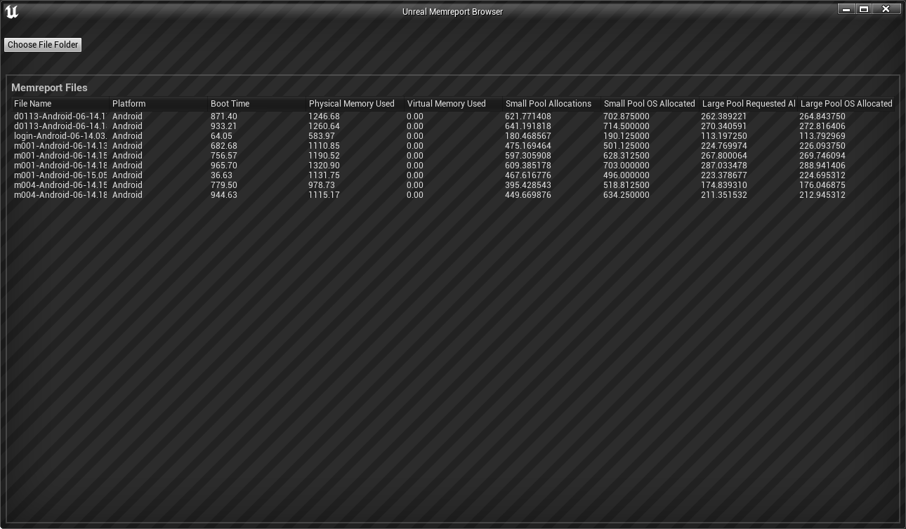
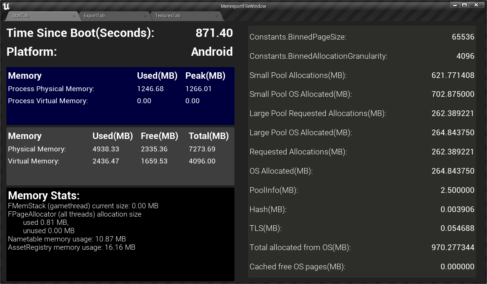
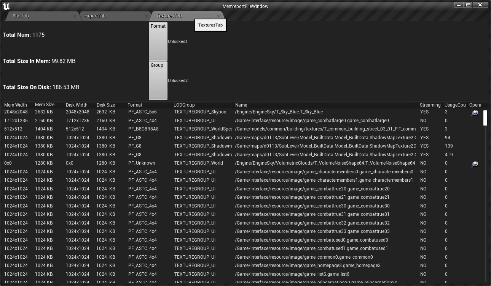

# MemreportParser

## 简介

UE4 插件
开发基于版本4.27 release
主要目的是对UE4命令行命令 MemReport -full产生的.memreport文件进行解析，输出各个部分的csv文件或者直接进行可视化，支持多文件对比进行内存变化的分析。

## 项目进度：

### 文件浏览

[//]: # (Img/Browser.png)

### 信息展示

[//]: # (Img/StatTab.png)

### Texture分析

[//]: # (Img/TextureTab.png)

## **感谢**

本项目使用JetBrains Rider进行开发，IDE License由JetBrains 开源项目申请提供

  
  
  

    <a href="https://www.jetbrains.com/lp/rider-unreal/">JetBrains 开源项目支持申请链接
    </a>

